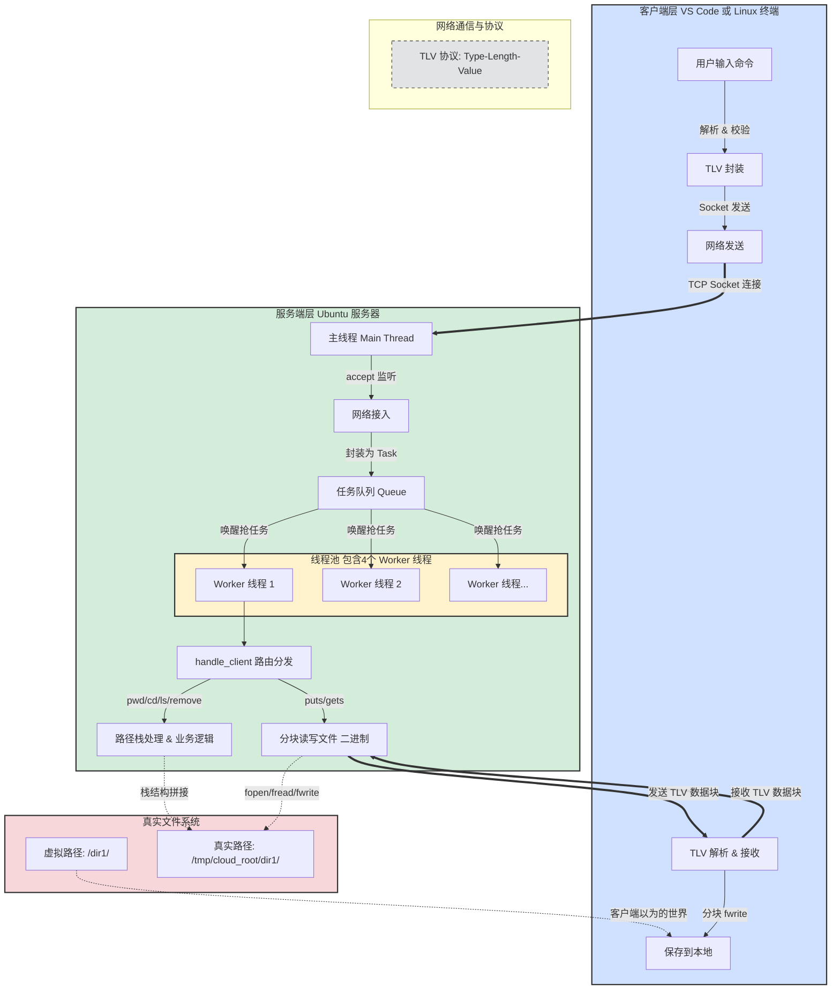

# Private-cloud-storage

基于TLV协议的私有云存储服务。

```mermaid
graph TD
    %% 定义样式
    classDef client fill:#d0e0ff,stroke:#333,stroke-width:2px;
    classDef server fill:#d4edda,stroke:#333,stroke-width:2px;
    classDef pool fill:#fff3cd,stroke:#333,stroke-width:2px;
    classDef fs fill:#f8d7da,stroke:#333,stroke-width:2px;
    classDef protocol fill:#e2e3e5,stroke:#333,stroke-width:1px,stroke-dasharray: 5 5;

    %% 客户端层
    subgraph Client [客户端层 VS Code 或 Linux 终端]
        C1[用户输入命令] -->|解析 & 校验| C2[TLV 封装]
        C2 -->|Socket 发送| C3[网络发送]
        C4[TLV 解析 & 接收] -->|分块 fwrite| C5[保存到本地]
    end
    class Client client;

    %% 网络与协议
    subgraph Network [网络通信与协议]
        P[TLV 协议: Type-Length-Value]
    end
    class P protocol;

    %% 服务端层
    subgraph Server [服务端层 Ubuntu 服务器]
        S1[主线程 Main Thread] -->|accept 监听| S2[网络接入]
        S2 -->|封装为 Task| S3[任务队列 Queue]
        
        subgraph ThreadPool [线程池 包含4个 Worker 线程]
            W1[Worker 线程 1]
            W2[Worker 线程 2]
            W3[Worker 线程...]
        end
        class ThreadPool pool;
        
        S3 -->|唤醒抢任务| W1
        S3 -->|唤醒抢任务| W2
        S3 -->|唤醒抢任务| W3
        
        W1 --> S4[handle_client 路由分发]
        S4 -->|pwd/cd/ls/remove| S5[路径栈处理 & 业务逻辑]
        S4 -->|puts/gets| S6[分块读写文件 二进制]
    end
    class Server server;

    %% 文件系统层
    subgraph FileSystem [真实文件系统]
        F1[虚拟路径: /dir1/]
        F2[真实路径: /tmp/cloud_root/dir1/]
        S5 -.->|栈结构拼接| F2
        S6 -.->|fopen/fread/fwrite| F2
        F1 -.->|客户端以为的世界| C5
    end
    class FileSystem fs;

    %% 连线交互
    C3 == TCP Socket 连接 ==> S1
    C4 == 接收 TLV 数据块 ==> S6
    S6 == 发送 TLV 数据块 ==> C4
```